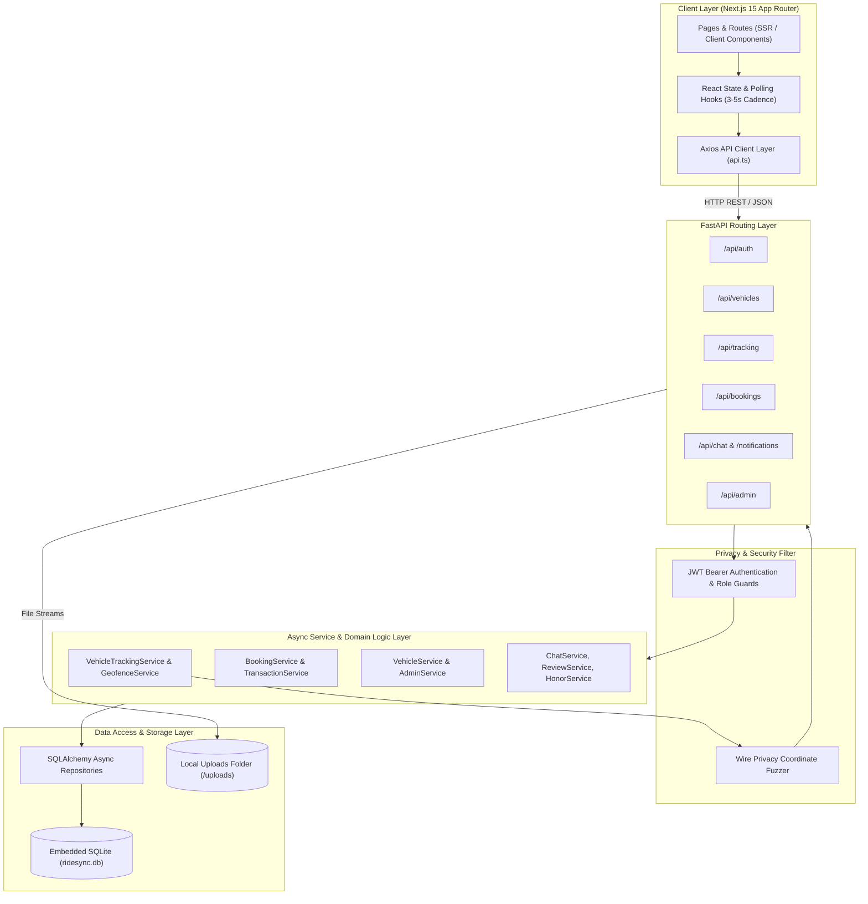
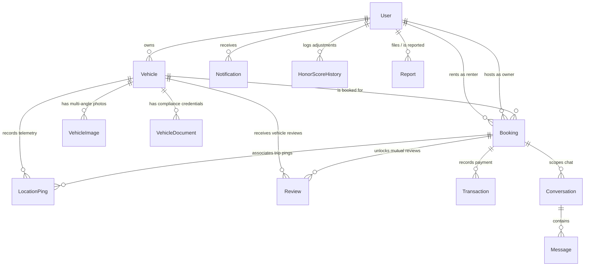

# RideSync System Requirements, Architecture Design & Methodology

---

## 1. Executive Summary & Project Overview

**RideSync** is a peer-to-peer (P2P) vehicle rental and fleet management marketplace engineered specifically as a self-contained "laptop version." It provides a complete production-grade feature set—including vehicle listings, multi-angle imagery, legal document verification, GPS tracking with dynamic privacy gradients, booking lifecycles, mock payments, in-app messaging, mutual reviews, and an honor-based trust scoring engine—without requiring external cloud infrastructure, Docker daemons, or database servers.

This document formally specifies:
1. **Functional Requirements (FRs)** across all domain modules and user roles.
2. **Non-Functional Requirements (NFRs)** governing performance, privacy, security, and portability.
3. **Architecture Design**, detailing the layered client-server modular monolith, data models, privacy filters, and communication protocols.
4. **Software Development Life Cycle (SDLC) Methodology**, analyzing candidate processes and justifying the **Iterative & Incremental Feature-Driven Agile** methodology used to build the platform across a coordinated four-person team structure.

---

## 2. Functional Requirements (FRs)

The functional requirements are categorized by system module and mapped to the four core development domains:

```
+-----------------------------------------------------------------------------------+
|                              RideSync System Scope                                |
+-----------------------------------------------------------------------------------+
|  [Auth & Profiles]  --> Shared Identity, JWT, Honor Scores                        |
|  [Person 1]         --> Vehicle Listings, Multi-Angle Photos, Document Approvals  |
|  [Person 2]         --> GPS Simulator, Ping Storage, Geofence Gradients, Alerts   |
|  [Person 3]         --> Availability, State Machine, Mock Payment, Receipts, Late |
|  [Person 4]         --> In-App Notifications, Polling Chat, Reviews, Disputes     |
|  [Admin Operations] --> Verification Queues, Moderation, System Parameters        |
+-----------------------------------------------------------------------------------+
```

### 2.1 Identity, Authentication & Profile Management (Shared Core)
- **FR-AUTH-1:** The system shall allow users to register using email and password, full name, phone number, address, and driving license details.
- **FR-AUTH-2:** The system shall authenticate users using JWT (JSON Web Tokens) with HS256 signature verification.
- **FR-AUTH-3:** The system shall support Google OAuth 2.0 credential sign-in.
- **FR-AUTH-4:** The system shall provide distinct role authorization: **Renter**, **Host / Owner**, and **Platform Admin**.
- **FR-AUTH-5:** The system shall maintain an **Honor Score** (0–100) per user and reflect categories: *Trusted* (90–100), *Good* (75–89), *Warning* (60–74), and *Restricted* (<60).
- **FR-AUTH-6:** Users with a *Restricted* honor score (<60) or suspended status shall be prevented from initiating new rental booking requests.

---

### 2.2 Person 1: Vehicle Listing & Document Verification
- **FR-P1-1 (Vehicle CRUD):** Hosts shall be able to create, read, update, and soft-delete vehicle listings with specifications including brand, model, year, vehicle type, fuel type, transmission, seating capacity, daily rental price, description, and pickup location.
- **FR-P1-2 (Multi-Angle Images):** The system shall store vehicle photos categorized by camera perspective (`FRONT`, `REAR`, `SIDE_LEFT`, `SIDE_RIGHT`, `INTERIOR`, `DASHBOARD`, `OTHER`) and designate a primary photo.
- **FR-P1-3 (Compliance Documents):** Hosts shall be required to upload compliance documentation:
  - **RC:** Registration Certificate (proof of ownership).
  - **PUC:** Pollution Under Control certificate (mandatory expiry date tracking).
  - **Service Record:** Maintenance certificate validating vehicle roadworthiness.
- **FR-P1-4 (Document Validation):** Uploaded files shall be validated against permitted MIME types (`application/pdf`, `image/png`, `image/jpeg`) and enforced under a 10 MB file size limit.
- **FR-P1-5 (Admin Verification Queue):** Admins shall have a dedicated queue to view, verify, or reject uploaded compliance documents with mandatory feedback reasons.
- **FR-P1-6 (Listing Approval Workflow):** Listings shall strictly follow the progression:
  $$\text{DRAFT} \xrightarrow{\text{Host Submit}} \text{PENDING} \xrightarrow{\text{Admin Review}} \text{APPROVED} \lor \text{REJECTED}$$
- **FR-P1-7 (Marketplace Discovery):** Renters shall be able to browse, search, and filter approved vehicles by brand, price range, vehicle category, fuel type, transmission, pickup city, and date availability.

---

### 2.3 Person 2: GPS Tracking, Simulator & Geofencing
- **FR-P2-1 (GPS Simulator):** The system shall provide a route replay engine (via CLI script `simulate_gps.py` and API `/api/tracking/vehicles/{id}/simulate`) that streams realistic coordinate waypoints without requiring physical GPS hardware.
- **FR-P2-2 (Ping Storage & History):** Every incoming or simulated telemetry event shall be persisted in the `location_pings` table with timestamp, vehicle ID, active booking ID, coordinates, speed, battery/fuel, and breach metrics.
- **FR-P2-3 (Host Fleet Map):** Hosts shall have access to an interactive visual map (`FleetMapView`) displaying the real-time status of all their vehicles.
- **FR-P2-4 (Permitted Radius Joint Agreement):** Host and renter shall be able to negotiate an operational radius for an active or confirmed trip:
  - Either party submits a proposed radius ($\text{5 km} \le r \le \text{300 km}$).
  - The counterparty receives an in-app alert with options to **Accept** or **Decline**.
  - Acceptance updates the booking's agreed radius and synchronizes the active vehicle's circular geofence boundary.
- **FR-P2-5 (Geofence Evaluation):** The system shall calculate great-circle distances via the Haversine formula against circular boundaries and determine breach distances.
- **FR-P2-6 (Wire Privacy Fuzzer & Accuracy Gradients):**
  - **In-Bounds ($\le \text{Radius}$):** Exact coordinates shall be obfuscated with a coarse spatial buffer ($\approx 1.5\text{ km}$).
  - **Near Breach ($0\text{--}2\text{ km outside}$):** Accuracy resolution sharpens to $\approx 500\text{ m}$.
  - **Distant / Critical Breach ($>5\text{ km outside}$):** Resolution sharpens to high-precision pinpoint mode ($\approx 80\text{ m}$).
- **FR-P2-7 (Out-of-Bounds Alerting):** When a vehicle exits its permitted boundary, an automated high-priority alert (`GEOFENCE_BREACH`) shall be dispatched to the host.
- **FR-P2-8 (Tracking Permission Scoping):** Renter access to vehicle telemetry shall be strictly restricted to periods with an active or confirmed booking.
- **FR-P2-9 (Overdue Location Reporting):** When an active rental exceeds its scheduled return timestamp, the host and admin shall gain access to an unmasked emergency location report with overdue hours and direct coordinates.

---

### 2.4 Person 3: Booking & Rental Lifecycle & Mock Payments
- **FR-P3-1 (Double-Booking Prevention):** The system shall disallow booking requests that overlap in date ranges with existing `PENDING`, `CONFIRMED`, or `RENTAL_ACTIVE` reservations for the same vehicle.
- **FR-P3-2 (State Machine Transitions):** Bookings shall enforce valid lifecycle transitions:
  $$\text{PENDING} \rightarrow \text{CONFIRMED} \rightarrow \text{RENTAL\_ACTIVE} \rightarrow \text{RETURNED} \rightarrow \text{COMPLETED}$$
  $$\text{PENDING} \lor \text{CONFIRMED} \rightarrow \text{CANCELLED}$$
- **FR-P3-3 (Pickup & Return Confirmation):**
  - Host or renter can confirm vehicle pickup, transitioning the booking to `RENTAL_ACTIVE`.
  - Renter confirms return, transitioning status to `RETURNED`.
  - Host finalizes the rental, marking status as `COMPLETED`.
- **FR-P3-4 (Mock Payment Processing):** Renters shall be able to execute mock payments through a "Pay Now" action, recording a financial ledger entry in the `transactions` table and transitioning `payment_status` to `PAID`.
- **FR-P3-5 (Receipt Generation):** Both host and renter shall be able to retrieve an itemized digital receipt detailing transaction ID, booking duration, total price, host info, and payment timestamp.
- **FR-P3-6 (Cancellation & Refund Flag):** Cancelling a booking with `payment_status = "PAID"` shall automatically transition the flag to `REFUNDED`.
- **FR-P3-7 (Late Return Detection):** Any booking in `RENTAL_ACTIVE` whose return timestamp is prior to the current system time shall automatically be flagged as `is_overdue = True`.

---

### 2.5 Person 4: Chat, Notifications, Reviews & Trust System
- **FR-P4-1 (In-App Notification Engine):** The system shall expose a unified notification service (`notify(user, type, payload)`) that creates actionable in-app notifications with badge counters and read-status tracking.
- **FR-P4-2 (Polling Chat):** The platform shall provide peer-to-peer messaging between renter and host scoped to specific bookings, updated via periodic HTTP polling (3-second cadence).
- **FR-P4-3 (Mutual Reviews):** Upon booking completion (`COMPLETED`), renter and host shall each be eligible to submit exactly one 1-to-5 star rating and written review.
- **FR-P4-4 (Honor Score Rewards & Penalties):**
  - **Rental Completion:** Automatically awards $+5$ honor points to both parties.
  - **Identity Verification:** Awards $+10$ points.
  - **Confirmed Cancellation:** Penalizes the cancelling party by $-10$ points.
  - **Late Return:** Penalizes $-15$ points.
- **FR-P4-5 (Audit Trail):** Every honor score change shall be recorded in `honor_score_history` with the old score, new score, delta, category, reason, and reference ID.
- **FR-P4-6 (Disputes & Reporting):** Users shall be able to file formal moderation reports (`LATE_RETURN`, `VEHICLE_DAMAGE`, `UNSAFE_BEHAVIOR`, `POLICY_VIOLATION`) for review and resolution by platform administrators.

---

## 3. Non-Functional Requirements (NFRs)

| ID | Category | Requirement Specification | Implementation & Measurement |
|---|---|---|---|
| **NFR-1** | **Performance** | API read endpoints shall respond within $\le 100\text{ ms}$ under normal local execution. | Asynchronous SQLAlchemy queries with `selectinload` to avoid N+1 query overhead; SQLite index optimizations on primary foreign keys. |
| **NFR-2** | **Zero-External Dependency** | The application must run entirely on a laptop with zero container runtimes or cloud database instances. | Embedded SQLite file database (`ridesync.db`); static local asset directory (`uploads/`). |
| **NFR-3** | **Security** | Passwords shall never be stored in plain text. Endpoint authorization must be verified per request. | Passwords hashed using `bcrypt`; stateful authentication enforced through signed JWTs; route authorization guards. |
| **NFR-4** | **Location Privacy** | Precise coordinates must never be leaked across client APIs during regular in-bounds travel. | Wire Privacy Fuzzer calculates pseudorandom deterministic offsets proportional to the dynamic accuracy radius before returning API payloads. |
| **NFR-5** | **Reliability & Consistency** | Concurrent booking attempts on identical dates must guarantee single-booking consistency without race conditions. | Database transactions with strict date-overlap exclusion checks prior to row insertion. |
| **NFR-6** | **Low-Overhead Polling** | Real-time updates must not overload laptop CPU or generate socket leaks. | Polling cadences (3s for active chat, 5s for notifications, 8s for fleet map) with lightweight JSON payloads and cached responses. |
| **NFR-7** | **Maintainability & Modularity** | Team members must be able to develop features independently without code collisions in shared files. | Domain-isolated module structures; decoupled seed scripts (`seed_<feature>.py`); explicit router definitions. |

---

## 4. Architecture Design & System Modeling

### 4.1 Architecture Style: Modular Layered Monolith

RideSync adopts a **Modular Layered Client-Server Architecture** (Modular Monolith). This style is optimal for local laptop execution because it eliminates microservice network serialization costs, complex container orchestration, and distributed transaction issues, while maintaining clean separation of concerns.



---

### 4.2 Key Architectural Components

1. **Client Layer (Next.js 15, React 18, Tailwind CSS):**
   - Utilizes Next.js App Router with client-side reactive components.
   - Polling managers poll `/api/notifications/`, `/api/chat/`, and `/api/tracking/fleet` without persistent WebSocket overhead.
   - Interactive maps rendered via Leaflet client wrappers.

2. **API & Routing Layer (FastAPI):**
   - Declarative Pydantic schemas validate all incoming requests and outgoing responses.
   - Dependency injection provides database sessions (`get_db`) and authenticated user context (`get_current_user`).

3. **Domain Services Layer:**
   - **`VehicleTrackingService`:** Orchestrates vehicle location updates, geofence breaches, and location history logging.
   - **`GeofenceService`:** Pure mathematical utility calculating Haversine distances and progressive accuracy radii.
   - **`BookingService`:** State machine controller validating transitions, overlap collisions, and honor score rewards.
   - **`TransactionService`:** Mock ledger recording financial payments and producing digital receipts.
   - **`NotificationService`:** Central notification dispatcher creating in-app alerts across all domains.

4. **Persistence Layer (SQLAlchemy 2.0 Async + aiosqlite):**
   - All entity tables (`users`, `vehicles`, `vehicle_images`, `vehicle_documents`, `location_pings`, `bookings`, `transactions`, `conversations`, `messages`, `reviews`, `honor_score_history`, `notifications`, `reports`, `system_configs`) are accessed via async sessions.

---

### 4.3 Database Entity-Relationship Summary



---

## 5. Software Development Methodology Analysis

### 5.1 Comparison of Candidate Methodologies

To select the most effective development model for this project, three primary methodologies were evaluated:

| Criterion | Traditional Waterfall | Iterative Waterfall | Agile / Feature-Driven Incremental (Chosen) |
|---|---|---|---|
| **Requirement Volatility** | Assumes static, fully frozen requirements from day one. | Allows sequential review gates between phases. | Embraces evolutionary refinement as dependent modules emerge. |
| **Team Parallelism** | Poor: Backend blockers stall frontend until completion. | Moderate: Stage gates create idle wait periods. | **High:** Team members build against API contracts in parallel sprints. |
| **Risk of Integration Failures** | Very high: "Big Bang" integration occurs at the final stage. | High: Integration happens late in testing. | **Low:** Continuous incremental integration and contract testing. |
| **Early Value Delivery** | None until the final release. | Partial deliverables after long cycles. | **Continuous:** Working increments delivered each milestone. |
| **Suitability for Multi-Person Dependencies** | Unsuitable: Person 2 and 3 blocked waiting for Person 1. | Inflexible: Blockers propagate across iterations. | **Ideal:** Explicit build order unblocks downstream team members early. |

---

### 5.2 Why Traditional Waterfall Was Rejected
In a standard Waterfall approach:
1. Requirements are fully signed off.
2. Architecture and database design must be 100% complete before any code is written.
3. All backend tables and endpoints must be finished before frontend UI work starts.
4. Testing only occurs at the very end.

**Why this fails for RideSync:**
- Person 2 (GPS Tracking) and Person 3 (Bookings) are inherently blocked until Person 1 (Vehicles) finishes basic vehicle tables.
- Person 4 (Reviews) is blocked until Person 3 (Bookings) reaches the `COMPLETED` state.
- Under Waterfall, three developers would remain idle during the initial phases, leading to severe end-of-project integration bottlenecks.

---

### 5.3 The Adopted Methodology: Iterative & Incremental Feature-Driven Agile

RideSync was developed using an **Iterative & Incremental Feature-Driven Development model** structured across dependency-ordered weekly increments:

```
+-----------------------------------------------------------------------------------------+
|                  RideSync Incremental Build Order & Sprint Roadmap                      |
+-----------------------------------------------------------------------------------------+
| Sprint 1: Shared Core Foundation & Unblockers                                           |
|   - Setup repo, SQLite schema, JWT login, seed skeletons                                |
|   - Person 1 delivers Vehicle CRUD & basic seed (Unblocks P2 & P3)                      |
|   - Person 4 delivers Notification Service (Unblocks P2 & P3 alerts)                    |
+-----------------------------------------------------------------------------------------+
| Sprint 2-3: Core Operations & Data Ingestion                                            |
|   - Person 1: Document uploads (RC, PUC, Service) & multi-angle images                  |
|   - Person 2: GPS simulator script & ping storage                                       |
|   - Person 3: Booking creation & double-booking prevention                              |
|   - Person 4: Owner-renter polling chat                                                 |
+-----------------------------------------------------------------------------------------+
| Sprint 4-5: Workflows & Domain Interactions                                             |
|   - Person 1: Approval workflow (Draft -> Pending -> Approved) & admin queue            |
|   - Person 2: Permitted radius negotiation & Wire Privacy gradients                     |
|   - Person 3: Booking lifecycle (Confirmed -> Active -> Returned) & mock payments      |
|   - Person 4: Mutual reviews (eligibility gated by Completed status)                    |
+-----------------------------------------------------------------------------------------+
| Sprint 6: Edge Cases, Safety & Governance                                               |
|   - Person 2: Overdue unmasked location reporting                                       |
|   - Person 3: Cancellations, refund status flags & late return detection                |
|   - Person 4: Honor score rules (+5/-15), audit logs & dispute reports                  |
+-----------------------------------------------------------------------------------------+
| Sprint 7: End-to-End Integration, Verification & Polish                                 |
|   - Full automated test suite (23 pytest cases covering all modules)                    |
|   - Unified master seed (`seed_all.py`) executing all module seeds                      |
|   - Production build validation (Next.js 15 type-safe build across 19 routes)           |
+-----------------------------------------------------------------------------------------+
```

### 5.4 Key Practices That Guaranteed Project Success

1. **Contract-First API Stubs:**  
   Before implementing internal business logic, the four developers agreed on API contracts (input payloads, response models, HTTP status codes). This allowed frontend components to be built against mock endpoints in parallel with backend development.

2. **Isolated Domain Segregation:**  
   Each feature set is organized into independent services, routers, and database tables. Changes to another person's table required explicit discussion, preventing conflicting schema migrations.

3. **Deterministic Modular Seeding:**  
   Each developer maintained their own independent seed script (`seed_vehicles.py`, `seed_tracking.py`, `seed_bookings.py`, `seed_chat.py`, etc.). The master script [`seed_all.py`](file:///d:/Github%20repositories/RideSync/backend/scripts/seed_all.py) executes them sequentially in strict dependency order, allowing anyone on the team to reset their database to a known clean state in seconds.

4. **Continuous Test Verification:**  
   Every sprint increment was paired with automated pytest tests (`test_booking_lifecycle.py`, `test_tracking_geofence.py`, `test_vehicle_documents.py`, `test_honor_scores.py`). The test suite validates the integration across all four domains simultaneously with zero regressions.
